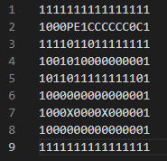

# 42_so_long

## Sobre o projeto
O projeto "so_long" é um jogo 2D top-down escrito em C e utilizando a biblioteca gráfica minilibx. O objetivo do jogo é controlar um mago habilidoso que precisa coletar poções mágicas para abrir um portal e escapar de um castelo assombrado antes que seja atingido por algum slime.

O repositório inclui um Makefile que pode ser usado para compilar o código fonte e criar o executável do jogo. Também há uma pasta "maps" com mapas válidos que podem ser usados com o programa. Para jogar o jogo, basta fornecer um endereço de arquivo ".ber" como argumento, que contém a estrutura do mapa em que o jogo será jogado. O mapa pode incluir obstáculos, poções mágicas escondidas e monstros-gosma espreitando em cada canto.

Além do arquivo Makefile, o repositório também inclui todos os arquivos de código fonte e recursos adicionais necessários para compilar e executar o programa "so_long".

## Regras do jogo
O objetivo do jogador é coletar todos os poções presentes no mapa e depois escapar escolhendo o caminho mais curto possível sem ser interceptado por alguma slime (se houver), as teclas W, A, S e D devem ser usadas para mover o personagem principal e a tecla ESC encerra o jogo. Boa sorte!!

## Criando um mapa ".ber"
Se você quiser criar um mapa ".ber" personalizado, aqui estão algumas regras a seguir:

### O mapa pode ser composto apenas por estes 6 caracteres:
* '0' para um espaço vazio
* '1' para uma parede
* 'C' para um colecionável
* 'E' para uma saída do mapa
* 'P' para a posição inicial do Mago
* 'X' para a posição inicial de um Slime
* O arquivo ".ber" deve ter no máximo 9 linhas e 16 caracteres por linha.
* O mapa deve conter pelo menos 1 saída, 1 colecionável e 1 posição inicial.
* O mapa deve ser retangular.
* O mapa deve ser fechado/rodeado por paredes. Se não for, o programa deve retornar um erro.
Você precisa verificar se há um caminho válido no mapa.

### Aqui está um exemplo de um mapa válido simples:

### Jogo com o mapa do exemplo anterior:
